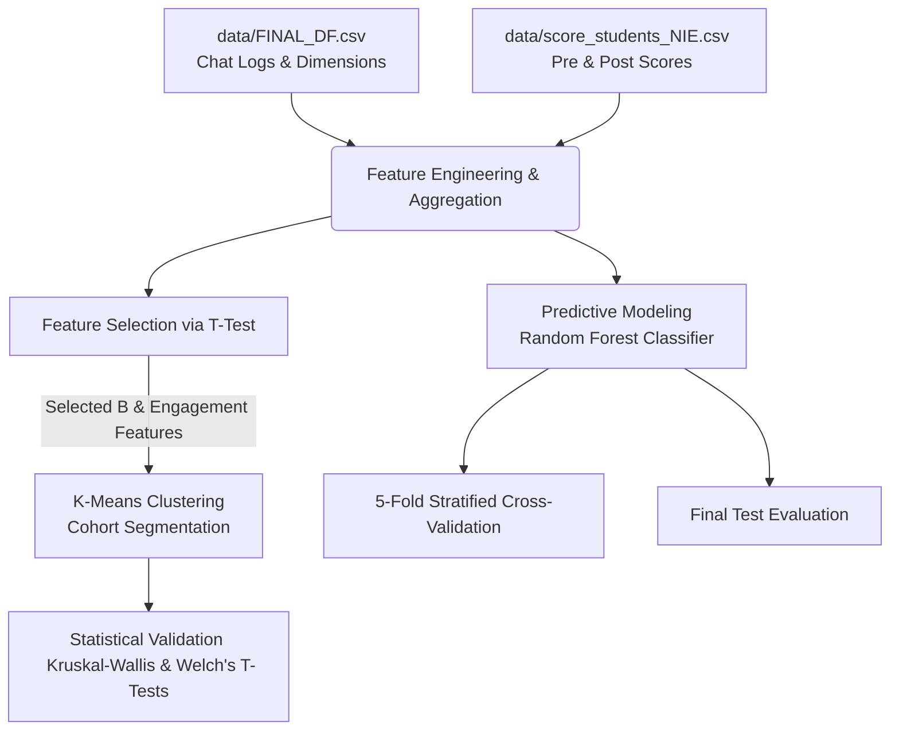

# Student Interaction Patterns & Learning Gains Analysis

This repository contains the analysis and modeling of student conversational interactions with an AI chatbot tutor and their subsequent academic performance. The project explores how different conversational behaviors affect student learning outcomes between a pre-test (without AI) and a post-test (with AI).

---

## Project Overview & Goals

The core objective is to analyze how students engage with an AI text classifier tutor and whether their conversational depth dictates their academic improvement (learning gains). The chat messages are classified across three primary educational dimensions:

*   **Dimension A (Asking):** Tracks the depth of inquiry (from `Basic Q` to `Complex Analytical`).
*   **Dimension B (Building Upon):** Tracks conversational flow and iteration (e.g., `Topic Shift`, `Direct Follow-up`, `Clarification Request`).
*   **Dimension C (Critical Thinking):** Tracks high-order cognitive processing (e.g., `Causal Analysis`, `Synthesis`, `Questioning the AI`).
*   **Engagement Rate:** A custom metric engineered to capture conversational depth beyond starting a thread:  
    `Engagement Rate = 1 - mean(Initial Inquiry)`
    
* **Objectives:** Behaviour Clustering, Network Analysis and Feature Importance

---

## Methodology and Analytical Pipeline

The complete analytical workflow implemented in [analysis.ipynb](file:///c:/Users/User/OneDrive%20-%20Nanyang%20Technological%20University/Documents/URECA%20Y2/NTU-URECA-Project/analysis.ipynb) is outlined below: Note that the data folder are omitted from the repo for obvious reasons

### 1. Data Merging & Preprocessing
*   Merged chat interaction features (`FINAL_DF.csv`) with academic performance metrics (`score_students_NIE.csv`) on `studId`.
*   Defined **learning gains (Score Diff)** as:  
    `Score Diff = Assignment 2 (With AI) - Assignment 1 (No AI)`
*   Classified students as **Improved** (`Score Diff > 0`) or **Declined** (`Score Diff <= 0`).

### 2. Feature Selection & Clustering
To segment the cohort without introducing the "curse of dimensionality", features were filtered using an independent two-sample t-test between the Improved and Declined groups. The chosen features representing conversational back-and-forth were:
*   `B_direct_followup`
*   `engagement_rate`
*   `B_topic_shift`
*   `B_clarification_request`
*   `B_initial_inquiry`
*   `B_acknowledgment_agreement`

Using **K-Means Clustering**, the cohort was segmented into three distinct behavioral profiles.

---

##  Results & Key Findings

### Cohort Segmentation Profiles

The clustering algorithm divided the 285-student cohort into three groups:

<table>
  <thead>
    <tr>
      <th align="left">Profile Name</th>
      <th align="center">Sample Size (n)</th>
      <th align="center">Avg Messages</th>
      <th align="center">Engagement Rate</th>
      <th align="center">Avg Learning Gains</th>
      <th align="center">Baseline Score (Pre-test)</th>
    </tr>
  </thead>
  <tbody>
    <tr>
      <td><b>Deep Engagers</b></td>
      <td align="center">10</td>
      <td align="center">61.60</td>
      <td align="center">94.37%</td>
      <td align="center"><b>+0.230</b></td>
      <td align="center">0.603</td>
    </tr>
    <tr>
      <td><b>Moderate Explorers</b></td>
      <td align="center">95</td>
      <td align="center">49.53</td>
      <td align="center">92.54%</td>
      <td align="center"><b>+0.127</b></td>
      <td align="center">0.628</td>
    </tr>
    <tr>
      <td><b>Surface Searchers</b></td>
      <td align="center">180</td>
      <td align="center">17.59</td>
      <td align="center">0.69%</td>
      <td align="center"><b>+0.042</b></td>
      <td align="center">0.638</td>
    </tr>
  </tbody>
</table>

### Core Insights

1.  **Superficial AI Use is the Default:**
    The majority of students (63%) fell into the **Surface Searchers** profile. Without active guidance or prompting strategies, students tend to engage in superficial interactions with near-zero conversational depth (0.69% engagement rate).
2.  **Interaction Style Over Prior Knowledge:**
    Baseline pre-test scores were highly similar across all three profiles (~60% to 64%). However, their subsequent learning gains diverged drastically based on how they chatted with the AI. Active learning (dialogue refinement, topic shifting, synthesis) is the mechanism driving actual conceptual understanding.
3.  **Active Engagement Predicts Performance:**
    Deep Engagers and Moderate Explorers achieved substantial learning gains (ranging from +12.7% to +23.0%), while Surface Searchers saw minimal gains (+4.2%).

---

##  Statistical Validation

### Kruskal-Wallis H-Test (Overall Profile Differences)
A non-parametric Kruskal-Wallis test was conducted using score improvement as the dependent variable:

<table>
  <thead>
    <tr>
      <th align="left">Test Metric</th>
      <th align="center">Value</th>
      <th align="left">Significance / Conclusion</th>
    </tr>
  </thead>
  <tbody>
    <tr>
      <td><b>H-Statistic</b></td>
      <td align="center">18.3482</td>
      <td><b>p-value = 0.000104</b> (&lt; 0.0005)</td>
    </tr>
    <tr>
      <td><b>Null Hypothesis</b></td>
      <td align="center">Rejected</td>
      <td>Conversational approach with the AI tutor fundamentally dictates academic growth.</td>
    </tr>
  </tbody>
</table>

### Post-Hoc Welch's T-Tests (Pairwise Cohort Comparisons)
To isolate which specific profiles diverged in performance, pairwise Welch's t-tests were executed with a Bonferroni correction (adjusted significance threshold: &alpha; = 0.0167):

<table>
  <thead>
    <tr>
      <th align="left">Profile A</th>
      <th align="left">Profile B</th>
      <th align="center">t-statistic</th>
      <th align="center">Bonferroni Adj. p-value</th>
      <th align="center">Statistically Significant?</th>
      <th align="left">Notes</th>
    </tr>
  </thead>
  <tbody>
    <tr>
      <td><b>Surface Searchers</b></td>
      <td><b>Moderate Explorers</b></td>
      <td align="center">-3.6034</td>
      <td align="center">0.0011</td>
      <td align="center"><b>Yes</b></td>
      <td>Shifting to active exploration yields vastly superior score gains</td>
    </tr>
    <tr>
      <td><b>Surface Searchers</b></td>
      <td><b>Deep Engagers</b></td>
      <td align="center">-4.1809</td>
      <td align="center">0.0036</td>
      <td align="center"><b>Yes</b></td>
      <td>Moving away from surface-level interaction yields a clear academic boost</td>
    </tr>
    <tr>
      <td><b>Moderate Explorers</b></td>
      <td><b>Deep Engagers</b></td>
      <td align="center">-2.3032</td>
      <td align="center">0.1202</td>
      <td align="center"><b>No</b></td>
      <td>Both active engagement strategies yield comparable performance benefits</td>
    </tr>
  </tbody>
</table>

---

## 🔮 Predictive Performance Modeling

To predict whether a student would improve or decline, a **Random Forest Classifier** was trained on the conversational features. Due to a moderate class imbalance (195 Improved vs. 90 Declined), the model utilized balanced class weights.

### Model Performance Metrics:

<table>
  <thead>
    <tr>
      <th align="left">Evaluation Metric</th>
      <th align="center">Score</th>
      <th align="left">Details</th>
    </tr>
  </thead>
  <tbody>
    <tr>
      <td><b>Mean 5-Fold CV ROC-AUC</b></td>
      <td align="center">0.670</td>
      <td>Stratified K-Fold validation on training set</td>
    </tr>
    <tr>
      <td><b>Test Set ROC-AUC</b></td>
      <td align="center">0.700</td>
      <td>Evaluation on unseen test set (20% holdout)</td>
    </tr>
  </tbody>
</table>
*   **Classification Report on Test Set:**

<table>
  <thead>
    <tr>
      <th align="left">Class</th>
      <th align="center">Precision</th>
      <th align="center">Recall</th>
      <th align="center">F1-Score</th>
      <th align="center">Support</th>
    </tr>
  </thead>
  <tbody>
    <tr>
      <td><b>False (Declined)</b></td>
      <td align="center">0.22</td>
      <td align="center">0.40</td>
      <td align="center">0.29</td>
      <td align="center">10</td>
    </tr>
    <tr>
      <td><b>True (Improved)</b></td>
      <td align="center">0.85</td>
      <td align="center">0.70</td>
      <td align="center">0.77</td>
      <td align="center">47</td>
    </tr>
    <tr>
      <td><b>Accuracy</b></td>
      <td align="center"></td>
      <td align="center"></td>
      <td align="center"><b>0.65</b></td>
      <td align="center">57</td>
    </tr>
  </tbody>
</table>

---

## 🕸 Network Transition Insights

Directed transition network analysis on state categories revealed that:
*   **Improved Students** display a thick, highly interconnected transition web in their state networks, meaning they actively build upon the AI's replies and advance the dialogue.
*   **Declined Students** show sparse, fractured state networks that stall out. A massive volume of transitions ends in `Non-Question` or repetitive loops, showing they get stuck instead of driving the inquiry forward.
